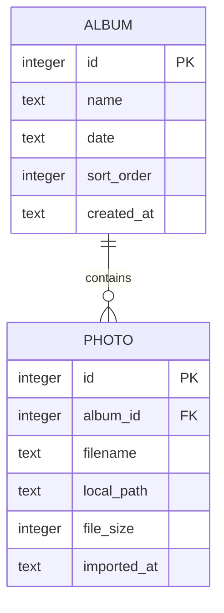

# Database Schema Design: Photo Organizer

The metadata for the Photo Organizer is persisted in a local SQLite database named `photo_organizer.db`. The schema comprises two main tables: `albums` and `photos`, with foreign key constraints to maintain relational integrity.

## Schema Diagrams



## Tables Specification

### 1. `albums`

Stores the album definitions, their chronological dates, and custom display orders.

| Column | Type | Constraints | Description |
|--------|------|-------------|-------------|
| `id` | INTEGER | PRIMARY KEY AUTOINCREMENT | Unique album identifier |
| `name` | TEXT | NOT NULL | User-defined album name |
| `date` | TEXT | NOT NULL | ISO Date string (`YYYY-MM-DD`) |
| `sort_order` | INTEGER | NOT NULL DEFAULT 0 | Ordering index for drag-and-drop |
| `created_at` | TEXT | DEFAULT CURRENT_TIMESTAMP | Date and time the album was created |

#### Indexes
- `idx_albums_date_order`: ON `albums(date DESC, sort_order ASC)` - Accelerates main dashboard rendering.

---

### 2. `photos`

Stores the metadata for individual photos and their association with specific albums.

| Column | Type | Constraints | Description |
|--------|------|-------------|-------------|
| `id` | INTEGER | PRIMARY KEY AUTOINCREMENT | Unique photo identifier |
| `album_id` | INTEGER | NOT NULL, REFERENCES `albums(id)` ON DELETE CASCADE | Associated album ID |
| `filename` | TEXT | NOT NULL | Original filename of the photo |
| `local_path` | TEXT | NOT NULL | Relative path where the photo copy resides |
| `file_size` | INTEGER | NOT NULL | Size of the image in bytes |
| `imported_at` | TEXT | DEFAULT CURRENT_TIMESTAMP | Import timestamp |

#### Indexes
- `idx_photos_album`: ON `photos(album_id)` - Accelerates loading photo tiles within a given album.

## Data Migrations & Initialization

Upon server startup, the database file is opened and migrations are run to ensure the tables are initialized if they do not exist. Refer to the migration scripts in the backend service layer for execution details.

```sql
PRAGMA foreign_keys = ON;

CREATE TABLE IF NOT EXISTS albums (
    id INTEGER PRIMARY KEY AUTOINCREMENT,
    name TEXT NOT NULL,
    date TEXT NOT NULL,
    sort_order INTEGER NOT NULL DEFAULT 0,
    created_at TEXT DEFAULT CURRENT_TIMESTAMP
);

CREATE TABLE IF NOT EXISTS photos (
    id INTEGER PRIMARY KEY AUTOINCREMENT,
    album_id INTEGER NOT NULL,
    filename TEXT NOT NULL,
    local_path TEXT NOT NULL,
    file_size INTEGER NOT NULL,
    imported_at TEXT DEFAULT CURRENT_TIMESTAMP,
    FOREIGN KEY (album_id) REFERENCES albums(id) ON DELETE CASCADE
);

CREATE INDEX IF NOT EXISTS idx_albums_date_order ON albums(date DESC, sort_order ASC);
CREATE INDEX IF NOT EXISTS idx_photos_album ON photos(album_id);
```
