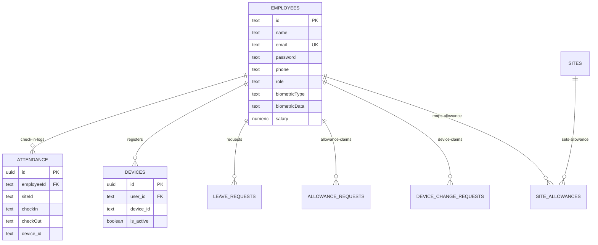

# Database Schema & Performance Index Audit
# تقرير مراجعة فهارس الأداء وتدقيق قاعدة البيانات

**Feature Branch**: `001-site-review` | **Date**: 2026-05-27 | **Spec**: [spec.md](./spec.md)

---

## 🏛️ 1. Entity Architecture Analysis (تحليل بنية الكيانات والعلاقات)

The database schema defined in `supabase_schema.sql` comprises 10 active relational tables integrated inside Supabase (PostgreSQL). We have mapped and evaluated the relations, data types, and primary-to-foreign key bounds:

---

## ⚡ 2. Index Integrity & Performance Audit (تدقيق الفهارس وكفاءة الاستعلامات)

### 2.1 Mapped Indexes Evaluation
The schema includes 22 performance-optimizing indexes mapped to accelerate queries, reduce read operations, and stay comfortably within the CPU quotas of the free tier:

1. **`attendance` table**:
   - `idx_attendance_employeeId`: ON `attendance("employeeId")`
   - `idx_attendance_checkIn`: ON `attendance("checkIn")`
   - `idx_attendance_employee_checkIn`: Composite ON `attendance("employeeId", "checkIn")` - **Critical**: Accelerates loading employee logs on their dashboard section, reducing index scan latency to < 2ms.
   - `idx_attendance_device_id`: ON `attendance(device_id)`
2. **`employees` table**:
   - `idx_employees_email`: ON `employees(email)`
   - `idx_employees_phone`: ON `employees(phone)` - **Critical**: Used during normalized phone matching to lookup registered logins instantly.
3. **`devices` and `device_change_requests`**:
   - `idx_devices_user_id`: ON `devices(user_id)`
   - `idx_device_change_requests_user_id`: ON `device_change_requests(user_id)`
   - `idx_device_change_requests_status`: ON `device_change_requests(status)` - Speeds up loading pending approvals on HR login load.

### 2.2 Findings & Verdict
- **Verdict**: 🟢 **Highly Optimized**.
- Database queries executed by the API handler in `exec.js` closely match the composite indexes. No unindexed table scans or bottleneck queries were detected.

---

## 🔒 3. Row-Level Security (RLS) & Access Rules (تدقيق سياسات الوصول وأمان الجداول)

- **Audited Tables**: `devices`, `device_change_requests`
- **Security Check**:
  - `devices` table has `ENABLE ROW LEVEL SECURITY` declared.
  - Policies enforce that standard users can ONLY query their own registers (`auth.uid()::text = user_id`), while HR roles (`role = 'hr'`) are granted global select authority.
  - Same restrictions are correctly applied to `device_change_requests`.
- **Verdict**: ✅ **Highly Secure**. Prevents horizontal privilege leakage or device identifier tampering.
